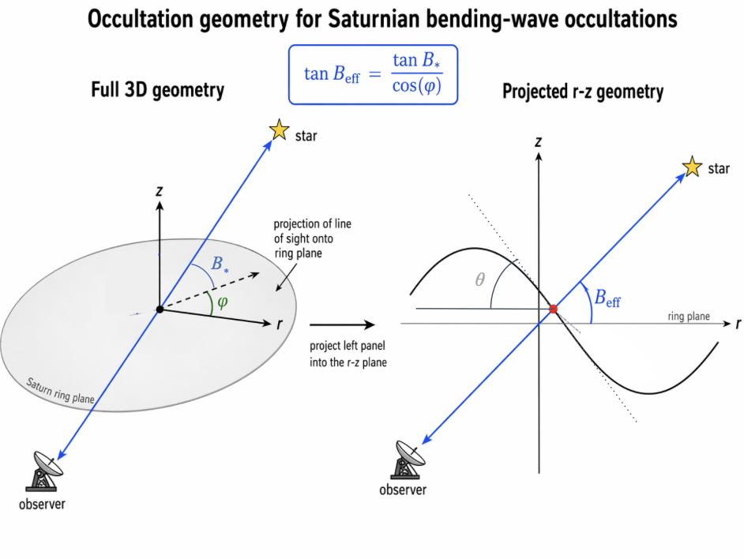
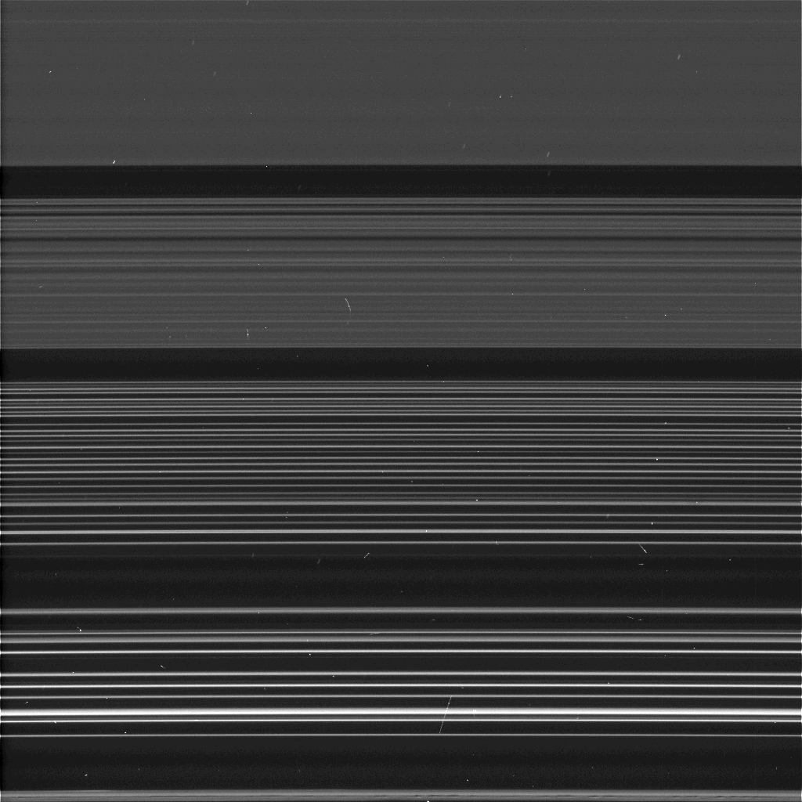
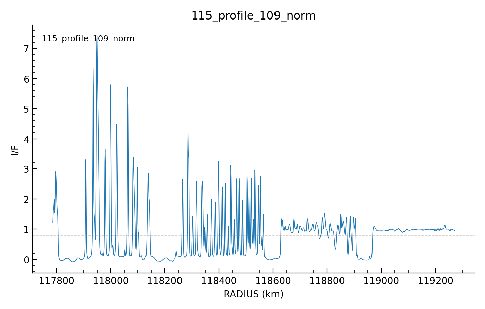
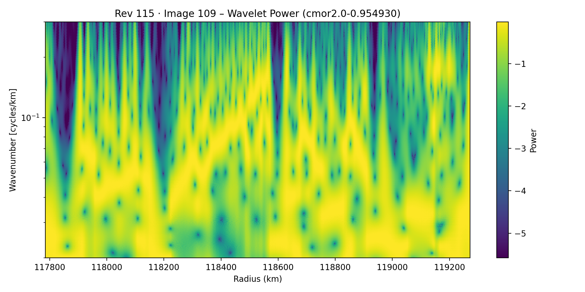
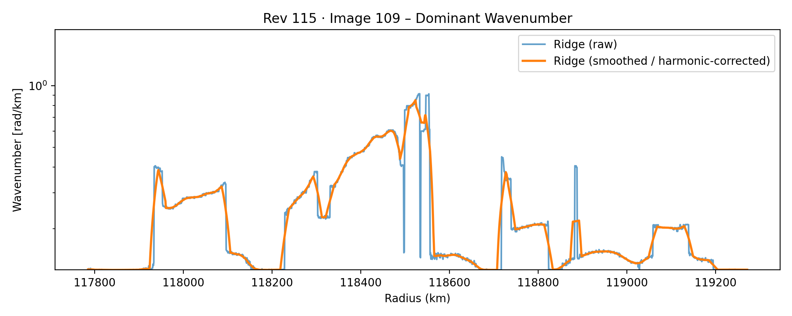
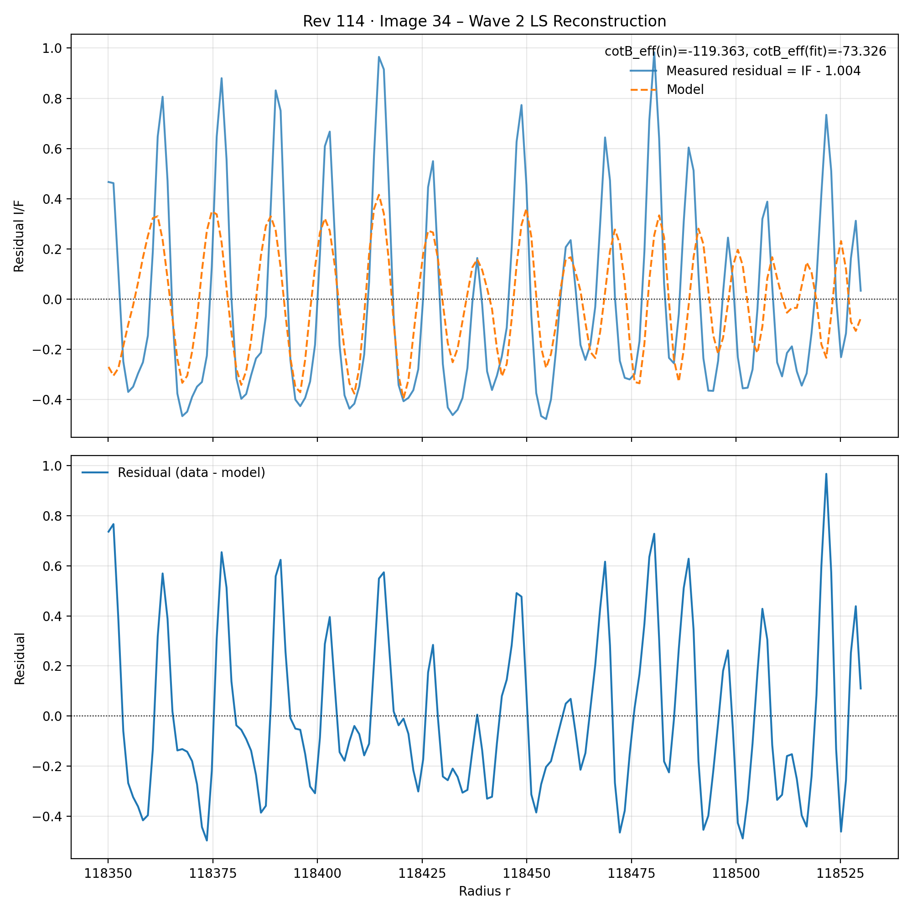
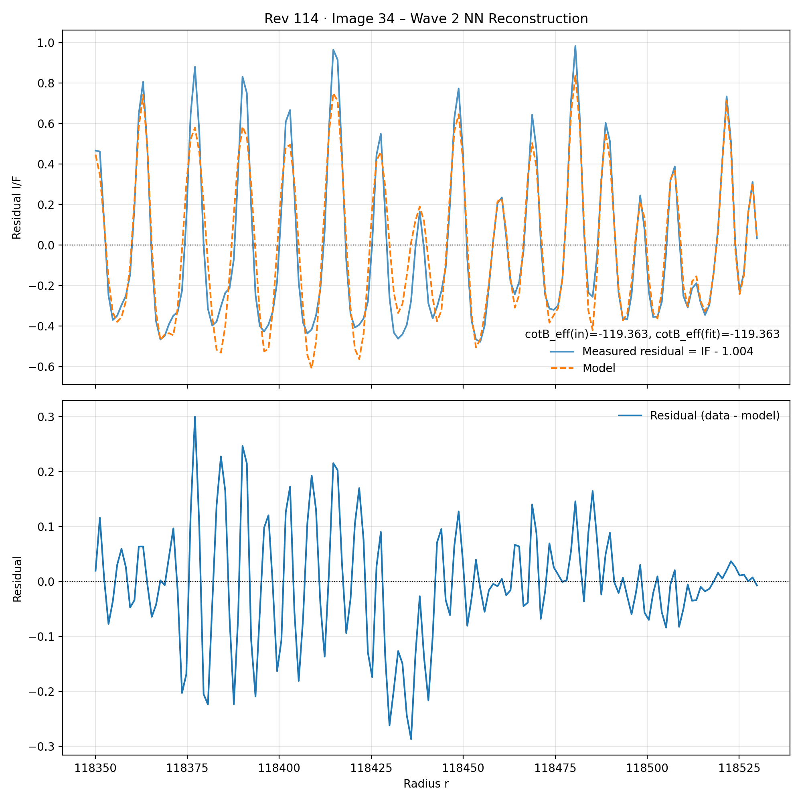

## Context

This work was conducted as part of the NASA Cassini Data Analysis Program at Cornell University.

Vertical bending waves in Saturn's rings are produced by resonant perturbations that force ring material out of the ring plane. In reflected-light observations, these vertical displacements alter the local surface slope and produce brightness variations whose wavelength and amplitude change with radius.

I developed an analysis pipeline for extracting and modeling these structures from Cassini Imaging Science Subsystem (ISS) observations of the Cassini Division.

## Data

The analysis uses two Cassini observing sequences from revolutions 114 and 115, containing six and twelve usable images respectively.

The two-dimensional ISS images were converted into azimuthally averaged radial brightness profiles with an effective spatial resolution of approximately 1.2 km. These observations were taken near Saturn's 2009 equinox, when the low opening angle of the rings produces particularly strong contrast from vertical structure.

I applied the same normalization, wave extraction, and modeling pipeline to every available image in both observing sequences.

## Signal Analysis

The wavelength of a bending wave changes continuously as it propagates away from its resonance. I therefore used a continuous wavelet transform to estimate the dominant local spatial frequency as a function of radius.

I developed an automated ridge-extraction procedure that identifies the dominant wavenumber from the wavelet power spectrum and corrects discontinuities caused by data gaps, harmonics, and overlapping ring structure.

The resulting wavenumber field is smoothed independently within each detected wave region and integrated radially to construct the wave phase used by the reconstruction models.

## Physical Modeling

Using the extracted wavenumber and phase, I constructed a forward model relating the vertical displacement of the rings to the brightness variations observed by Cassini.

I first estimated wave amplitudes using sliding-window least-squares regression. The model fits local sine and cosine components of the observed brightness signal while accounting for the effective ring opening angle of each observation.

This produced direct estimates of the vertical displacement amplitude as a function of radius and provided an interpretable baseline for evaluating more flexible models.

## Neural Network Modeling

I also developed a physics-informed one-dimensional convolutional neural network to infer the radial wave amplitude.

The network takes radius, local wavenumber, wavenumber gradient, wavelength scale, and viewing geometry as inputs. It predicts two amplitude components that are inserted into the same physical forward model used by the least-squares method.

The network therefore retains the wavelet-derived phase and geometric model while replacing the local regression step with a learned contextual estimate of the wave amplitude.

## Results

The pipeline identified multiple bending-wave structures in the Cassini Division and consistently recovered their changing spatial frequencies across the available observations.

The neural-network model substantially improved reconstruction accuracy relative to the least-squares approach. For revolution 114, representative neural-network reconstructions reached coefficients of determination of **0.985**, **0.925**, and **0.917** for three modeled wave regions, compared with **0.511**, **0.292**, and **0.109** from the corresponding least-squares reconstructions.

For revolution 115, the neural-network reconstructions reached **R² = 0.992** and **R² = 0.903** for the two wave regions present in the data.

I then applied the same neural-network reconstruction pipeline across every usable image in both observing sequences to compare the inferred wave amplitudes across observing geometry.

This dependence is likely associated with the geometric scaling used to convert observed surface slope into vertical displacement and remains an active part of the analysis.

The work is progressing toward publication.